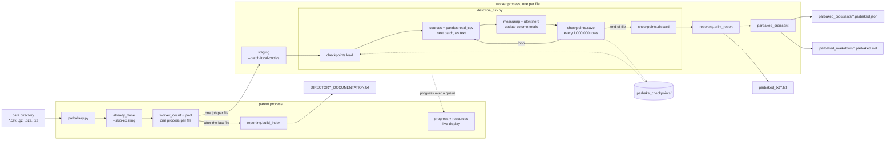

Here is the architecture of parbake, a Python tool. Use it as context.

parbake measures every CSV file directly inside a directory and writes, per
file: a measurement report, a par-baked Croissant metadata file (built to fail
validation until a person adds data types, a checksum and the correct
conformsTo), a Markdown rendering of it, and a directory index. It records no
judgements: no field meanings, types, licence or caveats.

Run: python3 parbakery.py <directory> [--full] [--out DIR] [--workers N]

Reading: CSV, plain or .gz/.bz2/.xz. First 1,000 rows by default, --full for
all. Values read as text. Batches of about 1,000,000 cells. Per column: rows,
empty, NA-like text, distinct values (up to 1,000 tracked) and counts, value
lengths, numeric count and min/max, all-empty and single-value flags. An
anonymisation check flags name-matched columns holding letters, and path-like
values.

Scaling: one worker process per file (default up to 8). A file is never split
across workers. --batch-local-copies copies each file to local disk first.

Fault tolerance: a failed file or dead worker is recorded and the run
continues. Checkpoints every 1,000,000 rows; resumed only if format version,
file size, mtime and measurement settings match; deleted when the file
finishes. --skip-existing skips files whose outputs already exist.

Modules:
  parbakery.py          command line; finds files; runs workers; builds the index
  describe_csv.py       measures one CSV: batches, totals, checkpoints
  measuring.py          ColumnSummary, per-column running totals
  identifiers.py        IdentifierCheck, the anonymisation check
  sources.py            file matching, compression, batch size, row estimates
  checkpoints.py        CheckpointStore: save, validate, load, discard
  already_done.py       --skip-existing, rebuilds index entries from outputs
  staging.py            per-worker local copies
  parbaked_croissant.py builds the par-baked Croissant and its Markdown
  reporting.py          per-file report and directory index
  progress.py           per-file live display (uses resources.py)
  resources.py          memory and CPU of the run's processes (psutil)
  formatting.py         human-readable numbers, sizes, durations
  settings.py           every constant
  croissant_to_md.py    standalone: any Croissant JSON to Markdown
  parsing_tools/pod_logs.py  standalone: Kubernetes pod logs to CSV

